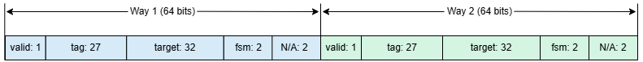
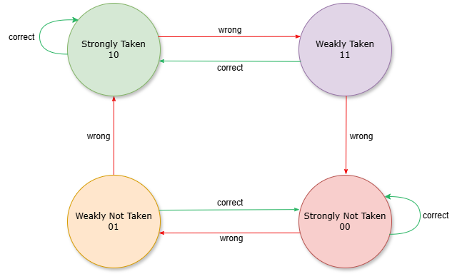
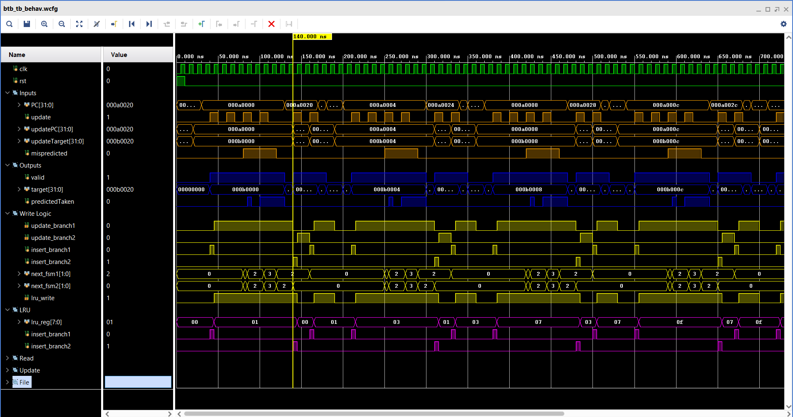
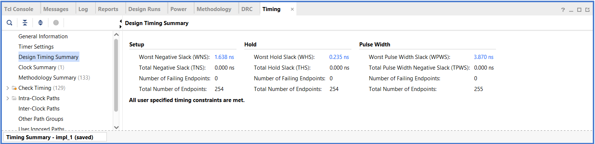
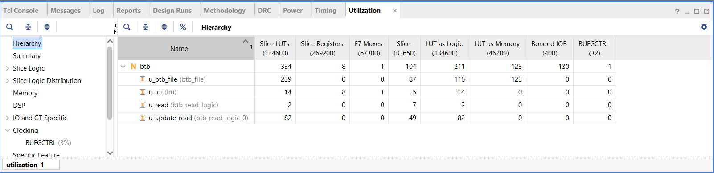
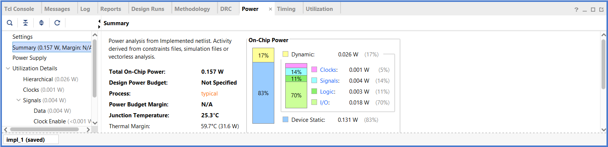

# Branch Target Buffer (BTB) - SystemVerilog Implementation

This repository contains the RTL design and verification environment for a **2-way set-associative Branch Target Buffer (BTB)** with an integrated **2-bit saturating branch predictor**, implemented in **SystemVerilog**.  
The BTB enables branch target and direction prediction in pipelined processors, enhancing control-flow efficiency.

---

## 📁 Repository Structure
```
├── src/
│ ├── btb.sv
│ ├── btb_file.sv 
│ ├── btb_read_logic.sv 
│ ├── btb_write_logic.sv 
│ ├── lru.sv 
│ └── predictor_fsm.sv 
│
├── test/
│ ├── btb_tb.sv 
│
├── imgs/ # Architecture diagrams and synthesis/simulation results
│
├── LICENSE
└── README.md
```

---

## ⚙️ Design Overview

### 🔸 Architecture
- **2-way set associative BTB** containing 8 sets for branch storage   
- **Tag comparison** per way with valid bit check  
- **LRU replacement policy** tracks least-recently-used entry per set   
- **2-bit saturating FSM** predicts branch direction  
- **Forwarding support**: Read path returns updated target immediately when the same PC is updated
---

### 🔸 BTB Entry Structure

Each BTB entry contains:

| Field      | Width | Description                                |
|------------|-------|--------------------------------------------|
| `valid`    | 1     | Indicates if the entry is valid            |
| `tag`      | 27    | Upper bits of the branch instruction address |
| `target`   | 32    | Predicted branch target address            |
| `fsm prediction` | 2   | 2-bit saturating counter for branch prediction |

Visual representation of BTB Entry:  

  

---

### 🔸 2-Bit Branch Predictor FSM

The predictor uses a 2-bit saturating counter with four states:

| State | Prediction | Meaning               |
|-------|-----------|----------------------|
| 00    | Not Taken | Strongly Not Taken    |
| 01    | Not Taken | Weakly Not Taken      |
| 10    | Taken     | Strongly Taken        |
| 11    | Taken     | Weakly Taken          |

State Transition Diagram::  

  

**FSM Transitions:**

- On **correct prediction**, the counter moves toward strongly taken/not taken or stays in the current state.  
- On **misprediction**, the counter moves toward the opposite prediction.

---

### 🔸 Signals
| Signal | Dir | Width | Description |
|--------|-----|--------|-------------|
| `clk` | in | 1 | Clock signal |
| `rst` | in | 1 | Active-high reset |
| `PC` | in | 32 | Program Counter |
| `update` | in | 1 | Update enable |
| `updatePC` | in | 32 | Address to update BTB entry |
| `updateTarget` | in | 32 | Target address to store |
| `mispredicted` | in | 1 | Branch misprediction signal |
| `valid` | out | 1 | Indicates BTB hit |
| `target` | out | 32 | Predicted branch target address |
| `predictedTaken` | out | 1 | Predicted branch direction |

---

## 🧩 Testbench

`btb_tb.sv` verifies BTB functionality through multiple directed test cases.

| Test # | Description | Expected Behavior |
|--------|--------------|------------------|
| 0 | Read before any update | `valid = 0` |
| 1 | Write new entry and read back | `valid = 1`, `target = updateTarget` |
| 2 | FSM transition under misprediction | FSM toggles between Taken/NotTaken |
| 3 | Simultaneous write and read | Returns newly written value |
| 4 | Entry eviction (3rd insert) | Oldest entry replaced |

---

## 🖥️ Simulation Instructions

### 🔹 Using Vivado/ ModelSim
1. Add all `src/` and `tb/` files to your simulation project.  
2. Set `btb_tb` as the top-level module.  
3. Run the simulation for at least **400 ns**.  

---

## 📈 Example Simulation Waveform

  

**Description:**
- Shows BTB lookups, updates, FSM transitions, and LRU activity  
- FSM resets to state 0 whenever a new entry is inserted
- valid asserts on BTB hits, and target outputs the predicted branch address  

---

## 📊 Synthesis and Implementation Results

### 🔸 Tool Used
**Xilinx Vivado Design Suite**

---

### ⏱️ Timing Summary

- **System Clock:** 100 MHz  
- **Clock Period:** 10 ns  

| Parameter | Value |
|------------|--------|
| **Worst Negative Slack (WNS)** | 1.638 ns |
| **Worst Hold Slack (WHS)** | 0.235 ns | 
| **Estimated Max Frequency (Fmax)** | ~120 MHz | 

  

✅ **All user-specified timing constraints are met.**

---

### 🧱 Resource Utilization

| Resource | Used | Available | Utilization |
|-----------|-------|------------|--------------|
| **Slice LUTs** | 334 | 134,600 | 0.25% |
| **Slice Registers** | 8 | 269,200 | <0.01% |

  

✅ **Compact design** — uses less than 0.3% of FPGA resources.
A portion of LUTs is used to implement memory blocks for BTB storage.

---

### ⚡ Power Summary

| Parameter | Value |
|------------|--------|
| **Total On-Chip Power** | 0.157 W |
| **Dynamic Power** | 0.026 W (17%) |
| **Device Static Power** | 0.131 W (83%) |

  

---

## 🧩 Future Improvements

- Add parameterized number of sets and ways  
- Add more automated tests to check corner cases   
- Improve synthesis results for lower area, power, or higher speed
- Explore using BRAM instead of LUT memory for larger BTBs, if memory size grows or LUT usage becomes significant

---

## 👩‍💻 Author

**Ayesha Quddus**  
MS Embedded Computing Systems, United Kingdom  

---

## 📜 License

This project is released under the **MIT License**.  
Feel free to use, modify, and share it with proper attribution.
